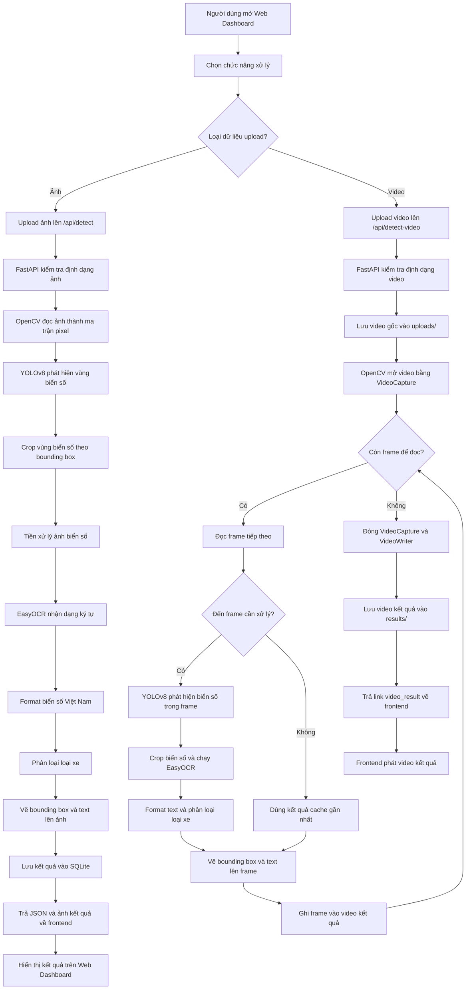
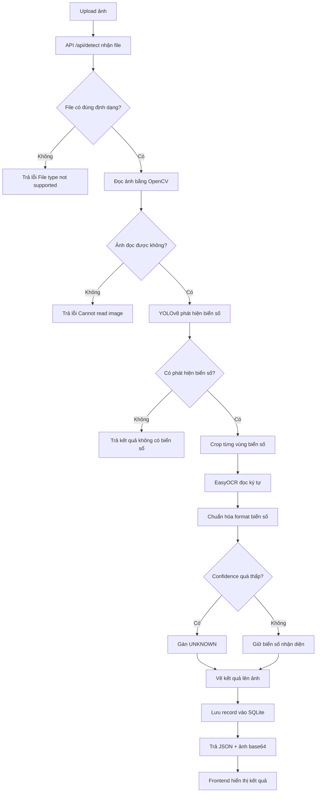
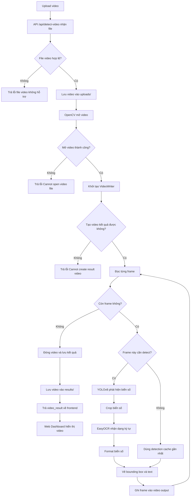
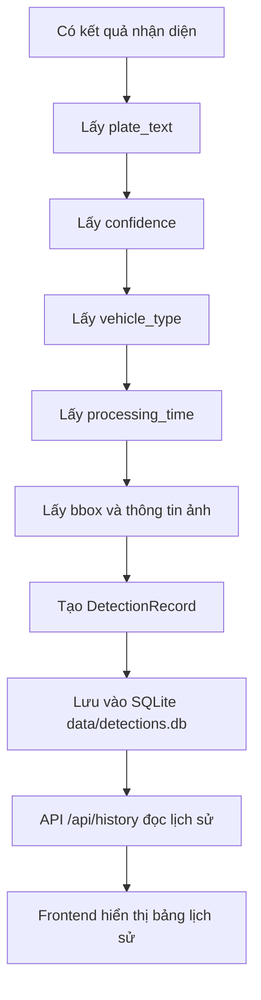

# Flowchart Hoạt Động Chương Trình

Tài liệu này mô tả luồng hoạt động tổng thể của hệ thống **ITS License Plate Detection** từ lúc người dùng mở web, upload ảnh/video, hệ thống xử lý bằng AI, trả kết quả và lưu lịch sử vào database.

## 1. Flowchart Tổng Thể

## 2. Flowchart Xử Lý Ảnh

## 3. Flowchart Xử Lý Video

## 4. Flowchart Lưu Lịch Sử

## 5. Giải Thích Ngắn Gọn

- **Frontend** cho phép người dùng upload ảnh hoặc video.
- **FastAPI** nhận request và điều phối xử lý.
- **OpenCV** đọc ảnh/video, crop biển số và ghi kết quả.
- **YOLOv8** phát hiện vị trí biển số trong ảnh hoặc frame video.
- **EasyOCR** đọc ký tự từ vùng biển số đã crop.
- **Regex/Formatter** chuẩn hóa biển số về định dạng Việt Nam.
- **SQLite** lưu lịch sử nhận diện để xem lại và thống kê.
- **Web Dashboard** hiển thị ảnh/video kết quả, danh sách biển số và lịch sử.
